# Nezam.Refahi.Backend Project Dependencies

## Mermaid Diagram

```mermaid
graph TB
    %% Main Web API
    WebApi["Nezam.Refahi.WebApi<br/>(Main API)"]
    
    %% Shared Projects
    SharedApp["Nezam.Refahi.Shared.Application<br/>(Common Application Logic)"]
    SharedDomain["Nezam.Refahi.Shared.Domain<br/>(Common Domain Objects)"]
    SharedInfra["Nezam.Refahi.Shared.Infrastructure<br/>(Common Infrastructure)"]
    
    %% Module Presentation Layers
    BasicDefPres["Nezam.Refahi.BasicDefinitions.Presentation"]
    IdentityPres["Nezam.Refahi.Identity.Presentation"]
    MembershipPres["Nezam.Refahi.Membership.Presentation"]
    FinancePres["Nezam.Refahi.Finance.Presentation"]
    RecreationPres["Nezam.Refahi.Recreation.Presentation"]
    SettingsPres["Nezam.Refahi.Settings.Presentation"]
    NotificationPres["Nezam.Refahi.Notification.Presentation"]
    
    %% Module Infrastructure Layers
    BasicDefInfra["Nezam.Refahi.BasicDefinitions.Infrastructure"]
    IdentityInfra["Nezam.Refahi.Identity.Infrastructure"]
    MembershipInfra["Nezam.Refahi.Membership.Infrastructure"]
    FinanceInfra["Nezam.Refahi.Finance.Infrastructure"]
    RecreationInfra["Nezam.Refahi.Recreation.Infrastructure"]
    SettingsInfra["Nezam.Refahi.Settings.Infrastructure"]
    NotificationInfra["Nezam.Refahi.Notification.Infrastructure"]
    
    %% Module Application Layers
    BasicDefApp["Nezam.Refahi.BasicDefinitions.Application"]
    IdentityApp["Nezam.Refahi.Identity.Application"]
    MembershipApp["Nezam.Refahi.Membership.Application"]
    FinanceApp["Nezam.Refahi.Finance.Application"]
    RecreationApp["Nezam.Refahi.Recreation.Application"]
    SettingsApp["Nezam.Refahi.Settings.Application"]
    NotificationApp["Nezam.Refahi.Notification.Application"]
    
    %% Module Contracts Layers
    BasicDefContracts["Nezam.Refahi.BasicDefinitions.Contracts"]
    IdentityContracts["Nezam.Refahi.Identity.Contracts"]
    MembershipContracts["Nezam.Refahi.Membership.Contracts"]
    FinanceContracts["Nezam.Refahi.Finance.Contracts"]
    RecreationContracts["Nezam.Refahi.Recreation.Contracts"]
    SettingsContracts["Nezam.Refahi.Settings.Contracts"]
    NotificationContracts["Nezam.Refahi.Notification.Contracts"]
    
    %% Module Domain Layers
    BasicDefDomain["Nezam.Refahi.BasicDefinitions.Domain"]
    IdentityDomain["Nezam.Refahi.Identity.Domain"]
    MembershipDomain["Nezam.Refahi.Membership.Domain"]
    FinanceDomain["Nezam.Refahi.Finance.Domain"]
    RecreationDomain["Nezam.Refahi.Recreation.Domain"]
    SettingsDomain["Nezam.Refahi.Settings.Domain"]
    NotificationDomain["Nezam.Refahi.Notification.Domain"]
    
    %% Plugin
    Plugin["Nezam.Refahi.Plugin.NezamMohandesi<br/>(External Plugin)"]
    
    %% WebApi Dependencies
    WebApi --> BasicDefPres
    WebApi --> IdentityPres
    WebApi --> MembershipPres
    WebApi --> FinancePres
    WebApi --> RecreationPres
    WebApi --> SettingsPres
    WebApi --> NotificationPres
    
    %% Presentation Layer Dependencies
    BasicDefPres --> BasicDefContracts
    BasicDefPres --> BasicDefInfra
    BasicDefPres --> SharedApp
    
    IdentityPres --> IdentityInfra
    IdentityPres --> SharedApp
    
    MembershipPres --> MembershipInfra
    MembershipPres --> SharedApp
    
    FinancePres --> FinanceInfra
    
    RecreationPres --> RecreationInfra
    
    SettingsPres --> SettingsInfra
    
    NotificationPres --> NotificationInfra
    
    %% Infrastructure Layer Dependencies
    BasicDefInfra --> SharedInfra
    BasicDefInfra --> BasicDefApp
    BasicDefInfra --> BasicDefDomain
    
    IdentityInfra --> SharedInfra
    IdentityInfra --> IdentityApp
    IdentityInfra --> IdentityDomain
    
    MembershipInfra --> SharedInfra
    MembershipInfra --> MembershipApp
    MembershipInfra --> MembershipDomain
    
    FinanceInfra --> SharedInfra
    FinanceInfra --> FinanceApp
    FinanceInfra --> FinanceDomain
    
    RecreationInfra --> SharedInfra
    RecreationInfra --> RecreationApp
    RecreationInfra --> RecreationDomain
    
    SettingsInfra --> SharedInfra
    SettingsInfra --> SettingsApp
    SettingsInfra --> SettingsDomain
    
    NotificationInfra --> SharedInfra
    NotificationInfra --> NotificationApp
    NotificationInfra --> NotificationDomain
    
    %% Application Layer Dependencies
    BasicDefApp --> SharedApp
    BasicDefApp --> BasicDefContracts
    BasicDefApp --> BasicDefDomain
    
    IdentityApp --> SharedApp
    IdentityApp --> IdentityContracts
    IdentityApp --> IdentityDomain
    
    MembershipApp --> SharedApp
    MembershipApp --> BasicDefContracts
    MembershipApp --> IdentityContracts
    MembershipApp --> SettingsContracts
    MembershipApp --> MembershipContracts
    MembershipApp --> MembershipDomain
    
    FinanceApp --> SharedApp
    FinanceApp --> FinanceContracts
    FinanceApp --> FinanceDomain
    
    RecreationApp --> SharedApp
    RecreationApp --> RecreationContracts
    RecreationApp --> RecreationDomain
    
    SettingsApp --> SharedApp
    SettingsApp --> SettingsContracts
    SettingsApp --> SettingsDomain
    
    NotificationApp --> SharedApp
    NotificationApp --> NotificationContracts
    NotificationApp --> NotificationDomain
    
    %% Contracts Layer Dependencies
    BasicDefContracts --> BasicDefDomain
    IdentityContracts --> IdentityDomain
    MembershipContracts --> MembershipDomain
    FinanceContracts --> FinanceDomain
    RecreationContracts --> RecreationDomain
    SettingsContracts --> SettingsDomain
    NotificationContracts --> NotificationDomain
    
    %% Domain Layer Dependencies
    BasicDefDomain --> SharedDomain
    IdentityDomain --> SharedDomain
    MembershipDomain --> SharedDomain
    FinanceDomain --> SharedDomain
    RecreationDomain --> SharedDomain
    SettingsDomain --> SharedDomain
    NotificationDomain --> SharedDomain
    
    %% Shared Layer Dependencies
    SharedInfra --> SharedApp
    SharedInfra --> SharedDomain
    SharedApp --> SharedDomain
    
    %% Plugin Dependencies
    Plugin --> MembershipContracts
    Plugin --> BasicDefContracts
    
    %% Styling
    classDef webApi fill:#e1f5fe,stroke:#01579b,stroke-width:3px
    classDef shared fill:#f3e5f5,stroke:#4a148c,stroke-width:2px
    classDef presentation fill:#e8f5e8,stroke:#1b5e20,stroke-width:2px
    classDef infrastructure fill:#fff3e0,stroke:#e65100,stroke-width:2px
    classDef application fill:#e3f2fd,stroke:#0d47a1,stroke-width:2px
    classDef contracts fill:#fce4ec,stroke:#880e4f,stroke-width:2px
    classDef domain fill:#f1f8e9,stroke:#33691e,stroke-width:2px
    classDef plugin fill:#ffebee,stroke:#b71c1c,stroke-width:2px
    
    class WebApi webApi
    class SharedApp,SharedDomain,SharedInfra shared
    class BasicDefPres,IdentityPres,MembershipPres,FinancePres,RecreationPres,SettingsPres,NotificationPres presentation
    class BasicDefInfra,IdentityInfra,MembershipInfra,FinanceInfra,RecreationInfra,SettingsInfra,NotificationInfra infrastructure
    class BasicDefApp,IdentityApp,MembershipApp,FinanceApp,RecreationApp,SettingsApp,NotificationApp application
    class BasicDefContracts,IdentityContracts,MembershipContracts,FinanceContracts,RecreationContracts,SettingsContracts,NotificationContracts contracts
    class BasicDefDomain,IdentityDomain,MembershipDomain,FinanceDomain,RecreationDomain,SettingsDomain,NotificationDomain domain
    class Plugin plugin
```

## Architecture Layers

### 1. **Presentation Layer** (Green)
- Contains API endpoints and controllers
- Handles HTTP requests/responses
- Depends on Infrastructure and Shared.Application

### 2. **Infrastructure Layer** (Orange)
- Contains data access implementations
- Database contexts and repositories
- External service integrations
- Depends on Application, Domain, and Shared.Infrastructure

### 3. **Application Layer** (Blue)
- Contains business logic and use cases
- Command/Query handlers
- Application services
- Depends on Contracts, Domain, and Shared.Application

### 4. **Contracts Layer** (Pink)
- Contains interfaces and DTOs
- Defines contracts between modules
- Depends on Domain layer

### 5. **Domain Layer** (Light Green)
- Contains business entities and domain logic
- Core business rules
- Depends on Shared.Domain

### 6. **Shared Layer** (Purple)
- Common functionality across modules
- Shared domain objects, application logic, and infrastructure

### 7. **Plugin Layer** (Red)
- External plugins that extend functionality
- Depends on specific module contracts

## Key Dependencies

1. **WebApi** depends on all Presentation layers
2. **Presentation** layers depend on their respective Infrastructure layers
3. **Infrastructure** layers depend on Application, Domain, and Shared.Infrastructure
4. **Application** layers depend on Contracts, Domain, and Shared.Application
5. **Contracts** layers depend on Domain
6. **Domain** layers depend on Shared.Domain
7. **Cross-module dependencies** exist in Application layers (e.g., Membership depends on BasicDefinitions, Identity, and Settings)
8. **Plugin** depends on specific module contracts for integration

## Module Structure

Each module follows Clean Architecture principles with:
- **Presentation**: API endpoints
- **Infrastructure**: Data access and external services
- **Application**: Business logic and use cases
- **Contracts**: Interfaces and DTOs
- **Domain**: Business entities and rules

This architecture ensures:
- **Separation of Concerns**: Each layer has a specific responsibility
- **Dependency Inversion**: High-level modules don't depend on low-level modules
- **Modularity**: Each module can be developed and maintained independently
- **Testability**: Clear boundaries make testing easier
- **Scalability**: Easy to add new modules or modify existing ones
