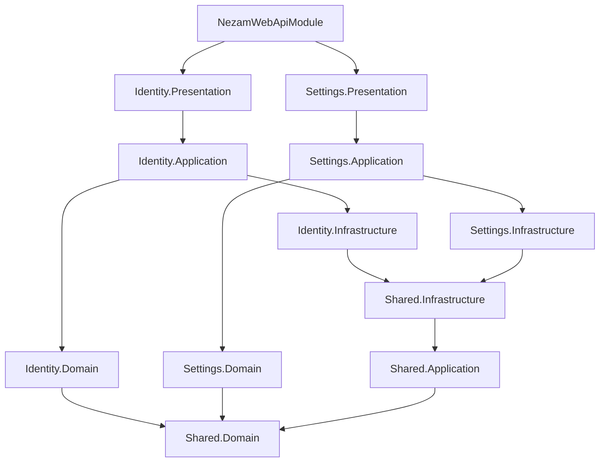

# Nezam.Refahi.Backend

A professional **Modular Monolith** backend solution built with **Domain-Driven Design (DDD)** principles, implementing **Clean Architecture** with **Bounded Contexts** separation.

## 🏗️ Architecture Overview

This project implements a **Modular Monolith** pattern that combines the benefits of microservices architecture (modularity, separation of concerns) with the simplicity of a monolithic deployment. Each module represents a **Bounded Context** with its own complete **Clean Architecture** layers.

### Key Architectural Principles

- **Domain-Driven Design (DDD)** with explicit Bounded Contexts
- **Clean Architecture** with clear layer separation
- **Modular Monolith** for maintainable and scalable codebase
- **Database Schema Separation** by Bounded Context
- **Independent Migrations** per context
- **Shared Kernel** for common domain concepts

## 📁 Project Structure

```
src/
├── Nezam.Refahi.WebApi/                    # API Gateway & Composition Root
├── Nezam.Refahi.Shared.Domain/             # Shared Kernel
├── Nezam.Refahi.Shared.Application/        # Shared Application Services
├── Nezam.Refahi.Shared.Infrastructure/     # Shared Infrastructure
└── Modules/                                # Bounded Context Modules
    ├── Identity/                           # Identity & Access Management
    │   ├── Nezam.Refahi.Identity.Domain/
    │   ├── Nezam.Refahi.Identity.Application/
    │   ├── Nezam.Refahi.Identity.Infrastructure/
    │   └── Nezam.Refahi.Identity.Presentation/
    └── Settings/                           # System Settings Management
        ├── Nezam.Refahi.Settings.Domain/
        ├── Nezam.Refahi.Settings.Application/
        ├── Nezam.Refahi.Settings.Infrastructure/
        └── Nezam.Refahi.Settings.Presentation/
```

## 🎯 Bounded Contexts

### 1. **Identity Context** (`identity` schema)
**Responsibility**: User authentication, authorization, and identity management

**Domain Concepts**:
- Users, Roles, Claims
- Authentication tokens and sessions
- OTP challenges and verification
- User preferences and settings

**Key Entities**:
- `User` - User accounts and profiles
- `UserToken` - JWT and refresh tokens
- `OtpChallenge` - OTP verification challenges
- `RefreshSession` - User session management
- `Role` - System roles and permissions

### 2. **Settings Context** (`settings` schema)
**Responsibility**: System configuration and settings management

**Domain Concepts**:
- Settings sections and categories
- System configuration values
- Settings change audit trail
- Dynamic configuration management

**Key Entities**:
- `SettingsSection` - Main settings sections
- `SettingsCategory` - Settings categories within sections
- `Setting` - Individual system settings
- `SettingChangeEvent` - Audit trail for setting changes

### 3. **Shared Kernel** (`shared` schema)
**Responsibility**: Common domain concepts used across contexts

**Domain Concepts**:
- Geographic data (provinces, cities)
- Common value objects
- Shared domain services
- Cross-cutting concerns

## 🏛️ Clean Architecture Layers

Each Bounded Context follows **Clean Architecture** principles with four distinct layers:

### 1. **Domain Layer** (`.Domain`)
- **Entities**: Core business objects with identity
- **Value Objects**: Immutable objects without identity
- **Aggregate Roots**: Consistency boundaries
- **Domain Services**: Business logic that doesn't belong to entities
- **Repositories**: Abstract data access contracts
- **Domain Events**: Business events and notifications
- **Specifications**: Business rules and queries
- **Policies**: Business rule implementations

### 2. **Application Layer** (`.Application`)
- **Commands**: Write operations (CQRS)
- **Queries**: Read operations (CQRS)
- **Command/Query Handlers**: Business logic orchestration
- **Application Services**: Use case implementations
- **DTOs**: Data transfer objects
- **Validators**: Input validation logic
- **Interfaces**: Application service contracts

### 3. **Infrastructure Layer** (`.Infrastructure`)
- **DbContext**: Entity Framework data access
- **Repository Implementations**: Concrete data access
- **Entity Configurations**: EF Core mappings
- **Migrations**: Database schema changes
- **External Services**: Third-party integrations
- **Background Services**: Async processing

### 4. **Presentation Layer** (`.Presentation`)
- **API Endpoints**: RESTful API controllers
- **Request/Response Models**: API contracts
- **Authentication/Authorization**: Security concerns
- **API Documentation**: Swagger/OpenAPI specs

## 🗄️ Database Architecture

### Schema Organization
The database uses **schema separation** to maintain clear boundaries between contexts:

```sql
-- Identity Bounded Context
identity.Users
identity.UserTokens
identity.OtpChallenges
identity.RefreshSessions
identity.Roles
identity.RoleClaims
identity.UserRoles
identity.UserClaims

-- Settings Bounded Context
settings.SettingsSections
settings.SettingsCategories
settings.Settings
settings.SettingChangeEvents

-- Shared Kernel
shared.Provinces
shared.Cities
```

### Migration Strategy
Each Bounded Context has **independent migrations**:

- **Identity Migrations**: `__EFMigrationsHistory__Identity` in `identity` schema
- **Settings Migrations**: `__EFMigrationsHistory__Settings` in `settings` schema
- **Shared Migrations**: `__EFMigrationsHistory__Shared` in `shared` schema

This allows:
- Independent schema evolution
- Context-specific rollbacks
- Clear ownership of database changes
- Reduced migration conflicts

## 🔧 Technology Stack

- **.NET 8.0** - Latest .NET framework
- **Entity Framework Core** - ORM with schema separation
- **MediatR** - CQRS and mediator pattern
- **FluentValidation** - Input validation
- **JWT Authentication** - Token-based security
- **Swagger/OpenAPI** - API documentation
- **SQL Server** - Primary database
- **Bonyan Framework** - Modular monolith framework

## 🚀 Getting Started

### Prerequisites
- .NET 8.0 SDK
- SQL Server (LocalDB or full instance)
- Visual Studio 2022 or VS Code

### Setup
1. **Clone the repository**
   ```bash
   git clone <repository-url>
   cd Nezam.Refahi.Backend
   ```

2. **Restore dependencies**
   ```bash
   dotnet restore
   ```

3. **Configure database**
   - Update connection string in `appsettings.json`
   - Run database migrations:
   ```bash
   dotnet ef database update --project src/Modules/Identity/Nezam.Refahi.Identity.Infrastructure
   dotnet ef database update --project src/Modules/Settings/Nezam.Refahi.Settings.Infrastructure
   ```

4. **Seed initial data**
   ```powershell
   .\seed-settings.ps1
   ```

5. **Run the application**
   ```bash
   dotnet run --project src/Nezam.Refahi.WebApi
   ```

## 📚 Development Guidelines

### Domain-Driven Design
- **Ubiquitous Language**: Use domain terms consistently
- **Bounded Contexts**: Keep contexts isolated and focused
- **Aggregates**: Maintain consistency boundaries
- **Value Objects**: Use for concepts without identity
- **Domain Events**: Communicate between aggregates

### Clean Architecture
- **Dependency Inversion**: Dependencies point inward
- **Interface Segregation**: Small, focused interfaces
- **Single Responsibility**: Each class has one reason to change
- **Open/Closed**: Open for extension, closed for modification

### Code Organization
- **Feature-based**: Group by business capability
- **Layer separation**: Clear boundaries between layers
- **Naming conventions**: Consistent and descriptive
- **Documentation**: Comprehensive XML documentation

## 🔄 Module Dependencies



## 🧪 Testing Strategy

- **Unit Tests**: Domain logic and business rules
- **Integration Tests**: Database operations and external services
- **API Tests**: End-to-end API functionality
- **Domain Tests**: Aggregate behavior and invariants

## 📖 API Documentation

The API is fully documented with Swagger/OpenAPI:
- **Development**: `https://localhost:5001/swagger`
- **Authentication**: JWT Bearer tokens
- **Versioning**: API versioning strategy
- **Error Handling**: Consistent error responses

## 🔐 Security

- **JWT Authentication**: Stateless token-based auth
- **Role-based Authorization**: Granular permissions
- **Input Validation**: Comprehensive validation
- **SQL Injection Protection**: Parameterized queries
- **CORS Configuration**: Cross-origin request handling

## 📈 Scalability Considerations

### Modular Monolith Benefits
- **Independent Development**: Teams can work on different modules
- **Clear Boundaries**: Well-defined context separation
- **Gradual Migration**: Easy to extract modules to microservices
- **Shared Resources**: Efficient resource utilization
- **Simplified Deployment**: Single deployment unit

### Future Microservices Migration
The modular structure enables easy extraction to microservices:
- Each module can become an independent service
- Database schemas can be separated
- API gateways can be introduced
- Service mesh can be implemented

## 🤝 Contributing

1. Follow DDD and Clean Architecture principles
2. Maintain bounded context boundaries
3. Write comprehensive tests
4. Update documentation
5. Follow coding standards and conventions

## 📄 License

This project is licensed under the MIT License - see the LICENSE file for details.

---

**Built with ❤️ using Domain-Driven Design and Clean Architecture principles**