# Nezam Refahi Backend Architecture

This document contains the architecture diagram for the Nezam Refahi Backend solution.

## Solution Architecture

```mermaid
graph TD
    subgraph "Web API Layer"
        API["🌐 Nezam.Refahi.WebApi<br/>Main Entry Point"]
    end

    subgraph "Shared Components"
        SharedDomain["📦 Nezam.Refahi.Shared.Domain<br/>Common Entities & Value Objects"]
        SharedApp["📦 Nezam.Refahi.Shared.Application<br/>Common Application Services"]
        SharedInfra["📦 Nezam.Refahi.Shared.Infrastructure<br/>Common Infrastructure"]
    end

    subgraph "Identity Module"
        IdentityDomain["🔐 Identity.Domain<br/>User, Role, OTP Entities"]
        IdentityApp["🔐 Identity.Application<br/>Auth Commands & Queries"]
        IdentityContracts["🔐 Identity.Contracts<br/>DTOs & Events"]
        IdentityInfra["🔐 Identity.Infrastructure<br/>Database & Services"]
        IdentityPresentation["🔐 Identity.Presentation<br/>API Endpoints"]
    end

    subgraph "Membership Module"
        MembershipDomain["👥 Membership.Domain<br/>Member & Role Entities"]
        MembershipApp["👥 Membership.Application<br/>Member Commands & Queries"]
        MembershipContracts["👥 Membership.Contracts<br/>DTOs & Services"]
        MembershipInfra["👥 Membership.Infrastructure<br/>Database Layer"]
        MembershipPresentation["👥 Membership.Presentation<br/>API Endpoints"]
    end

    subgraph "Settings Module"
        SettingsDomain["⚙️ Settings.Domain<br/>Setting Entities"]
        SettingsApp["⚙️ Settings.Application<br/>Settings Commands & Queries"]
        SettingsContracts["⚙️ Settings.Contracts<br/>DTOs"]
        SettingsInfra["⚙️ Settings.Infrastructure<br/>Database Layer"]
        SettingsPresentation["⚙️ Settings.Presentation<br/>API Endpoints"]
    end

    subgraph "Plugins"
        NezamPlugin["🔌 Plugin.NezamMohandesi<br/>External System Integration<br/>Member Role Seeding Service"]
    end

    %% API Dependencies
    API --> IdentityPresentation
    API --> MembershipPresentation
    API --> SettingsPresentation
    API --> SharedInfra

    %% Identity Module Dependencies
    IdentityPresentation --> IdentityApp
    IdentityApp --> IdentityDomain
    IdentityApp --> IdentityContracts
    IdentityInfra --> IdentityDomain
    IdentityApp --> SharedApp

    %% Membership Module Dependencies
    MembershipPresentation --> MembershipApp
    MembershipApp --> MembershipDomain
    MembershipApp --> MembershipContracts
    MembershipInfra --> MembershipDomain
    MembershipApp --> SharedApp

    %% Settings Module Dependencies
    SettingsPresentation --> SettingsApp
    SettingsApp --> SettingsDomain
    SettingsApp --> SettingsContracts
    SettingsInfra --> SettingsDomain
    SettingsApp --> SharedApp

    %% Plugin Dependencies
    NezamPlugin --> MembershipContracts
    NezamPlugin --> MembershipDomain

    %% Shared Dependencies
    SharedApp --> SharedDomain
    SharedInfra --> SharedApp
    IdentityDomain --> SharedDomain
    MembershipDomain --> SharedDomain
    SettingsDomain --> SharedDomain

    %% Cross-Module Integration
    MembershipApp -.-> IdentityContracts

    %% Styling
    classDef apiClass fill:#e1f5fe,stroke:#01579b,color:#000
    classDef sharedClass fill:#f3e5f5,stroke:#4a148c,color:#000
    classDef identityClass fill:#e8f5e8,stroke:#1b5e20,color:#000
    classDef membershipClass fill:#fff3e0,stroke:#e65100,color:#000
    classDef settingsClass fill:#e0f2f1,stroke:#00695c,color:#000
    classDef pluginClass fill:#fce4ec,stroke:#880e4f,color:#000

    class API apiClass
    class SharedDomain,SharedApp,SharedInfra sharedClass
    class IdentityDomain,IdentityApp,IdentityContracts,IdentityInfra,IdentityPresentation identityClass
    class MembershipDomain,MembershipApp,MembershipContracts,MembershipInfra,MembershipPresentation membershipClass
    class SettingsDomain,SettingsApp,SettingsContracts,SettingsInfra,SettingsPresentation settingsClass
    class NezamPlugin pluginClass
```

## Architecture Overview

This diagram shows the modular architecture of the Nezam Refahi Backend solution following Clean Architecture principles:

### 🌐 **Web API Layer**
- **Nezam.Refahi.WebApi**: Main entry point that orchestrates all modules and handles HTTP requests

### 📦 **Shared Components**
- **Shared.Domain**: Base entities, value objects, specifications, and common domain logic
- **Shared.Application**: Common application services, behaviors, and cross-cutting concerns
- **Shared.Infrastructure**: Base repositories, unit of work pattern, and infrastructure services

### 🔐 **Identity Module**
Handles authentication and authorization:
- **Domain**: User, Role, OTP challenge entities and business rules
- **Application**: Login, logout, OTP verification commands and queries
- **Contracts**: DTOs, events, and service interfaces
- **Infrastructure**: Database context, repositories, and external services
- **Presentation**: Authentication API endpoints

### 👥 **Membership Module**
Manages member information and roles:
- **Domain**: Member, Role entities and domain services
- **Application**: Member management commands and queries
- **Contracts**: DTOs and service contracts
- **Infrastructure**: Database layer and repositories
- **Presentation**: Member management API endpoints

### ⚙️ **Settings Module**
Application configuration management:
- **Domain**: Setting entities and validation rules
- **Application**: CRUD operations for settings
- **Contracts**: Setting DTOs
- **Infrastructure**: Database layer
- **Presentation**: Settings API endpoints

### 🔌 **Plugin System**
External system integrations:
- **NezamMohandesi Plugin**: Integrates with external CEDO system for member role seeding using a hosted service

## Key Architectural Patterns

1. **Clean Architecture**: Clear separation of concerns with dependency inversion
2. **Modular Monolith**: Organized into bounded contexts (modules)
3. **CQRS**: Separate command and query responsibilities
4. **Domain-Driven Design**: Rich domain models with business logic
5. **Plugin Architecture**: Extensible through plugins for external integrations

## Dependencies Flow

- **Outward Dependencies**: All layers depend inward (Presentation → Application → Domain)
- **Cross-Module**: Modules communicate through contracts and events
- **Shared Components**: All modules can depend on shared components
- **Plugin Integration**: Plugins integrate with domain and contracts layers