# Nezam Refahi Backend - Detailed Architecture

This document provides a comprehensive overview of the Nezam Refahi Backend solution architecture with detailed information about each project and its responsibilities.

## Detailed Solution Architecture

```mermaid
graph TD
    subgraph "🌐 API Layer"
        API["<b>Nezam.Refahi.WebApi</b><br/>📋 Entry Point & Orchestration<br/>• ASP.NET Core Web API<br/>• Swagger/OpenAPI Documentation<br/>• Dependency Injection Container<br/>• Middleware Pipeline<br/>• CORS & Security Headers"]
    end

    subgraph "📦 Shared Components"
        SharedDomain["<b>Shared.Domain</b><br/>🏗️ Common Domain Foundation<br/>• Base Entities & Aggregate Roots<br/>• Value Objects (NationalId, PhoneNumber)<br/>• Domain Events & Specifications<br/>• Business Rules & Exceptions<br/>• Iran Geography (Cities, Provinces)"]
        
        SharedApp["<b>Shared.Application</b><br/>⚙️ Cross-Cutting Concerns<br/>• CQRS Base Classes<br/>• Validation Behaviors<br/>• Pagination Support<br/>• Application Result Patterns<br/>• Common Interfaces (IUnitOfWork)"]
        
        SharedInfra["<b>Shared.Infrastructure</b><br/>🔧 Infrastructure Services<br/>• Base Unit of Work<br/>• Permission Providers<br/>• Common Database Configurations<br/>• External Service Integrations"]
    end

    subgraph "🔐 Identity Module - Authentication & Authorization"
        IdentityDomain["<b>Identity.Domain</b><br/>👤 Identity Business Logic<br/>• User Entity (Phone-based Auth)<br/>• Role & UserRole Entities<br/>• OTP Challenge System<br/>• User Preferences & Claims<br/>• Refresh Token Management"]
        
        IdentityApp["<b>Identity.Application</b><br/>📱 Auth Features<br/>• Send OTP Command<br/>• Verify OTP Command<br/>• Update Profile Command<br/>• Refresh Token Command<br/>• Logout Command<br/>• Get Current User Query"]
        
        IdentityContracts["<b>Identity.Contracts</b><br/>📋 Integration Layer<br/>• User & Role DTOs<br/>• Authentication Events<br/>• External User Integration<br/>• User Pool Services<br/>• Validation Results"]
        
        IdentityInfra["<b>Identity.Infrastructure</b><br/>💾 Data & Services<br/>• EF Core DbContext<br/>• User & Role Repositories<br/>• OTP Generation & Validation<br/>• Token Services<br/>• SMS/Email Services<br/>• Data Seeding"]
        
        IdentityPresentation["<b>Identity.Presentation</b><br/>🌐 API Endpoints<br/>• Authentication Endpoints<br/>• User Management APIs<br/>• Request/Response Models<br/>• API Documentation Examples"]
    end

    subgraph "👥 Membership Module - Member Management"
        MembershipDomain["<b>Membership.Domain</b><br/>👨‍💼 Member Business Logic<br/>• Member Entity<br/>• Member Claims & Roles<br/>• Domain Services<br/>• Business Rules<br/>• Member Specifications"]
        
        MembershipApp["<b>Membership.Application</b><br/>🎯 Member Operations<br/>• Member Registration<br/>• Profile Management<br/>• Role Assignment<br/>• Member Validation<br/>• Event Consumers"]
        
        MembershipContracts["<b>Membership.Contracts</b><br/>🤝 Integration APIs<br/>• Member DTOs<br/>• External Member Storage<br/>• Member Service Contracts<br/>• Integration Events"]
        
        MembershipInfra["<b>Membership.Infrastructure</b><br/>🗄️ Persistence Layer<br/>• EF Core DbContext<br/>• Member Repository<br/>• Database Migrations<br/>• Unit of Work Implementation"]
        
        MembershipPresentation["<b>Membership.Presentation</b><br/>📡 Member APIs<br/>• Member CRUD Endpoints<br/>• Member Search APIs<br/>• Role Management<br/>• API Contracts"]
    end

    subgraph "⚙️ Settings Module - Configuration Management"
        SettingsDomain["<b>Settings.Domain</b><br/>📊 Settings Business Logic<br/>• Setting Entity<br/>• Setting Categories<br/>• Setting Sections<br/>• Validation Rules<br/>• Setting Specifications"]
        
        SettingsApp["<b>Settings.Application</b><br/>🔧 Settings Operations<br/>• Get Settings Query<br/>• Update Settings Command<br/>• Bulk Update Command<br/>• Settings by Section Query<br/>• Validation Services"]
        
        SettingsContracts["<b>Settings.Contracts</b><br/>📑 Settings DTOs<br/>• Setting Response Models<br/>• Category & Section DTOs<br/>• Update Request Models<br/>• Filtering Options"]
        
        SettingsInfra["<b>Settings.Infrastructure</b><br/>💽 Settings Storage<br/>• EF Core DbContext<br/>• Settings Repository<br/>• Data Seeding<br/>• Database Migrations<br/>• Unit of Work"]
        
        SettingsPresentation["<b>Settings.Presentation</b><br/>🎛️ Settings APIs<br/>• Settings CRUD Endpoints<br/>• Bulk Operations<br/>• Category Management<br/>• Configuration APIs"]
    end

    subgraph "🔌 Plugin System - External Integrations"
        NezamPlugin["<b>Plugin.NezamMohandesi</b><br/>🏢 CEDO Integration<br/>• External Member Storage<br/>• CEDO Database Context<br/>• Member Role Seeding Service<br/>• Member Type Repository<br/>• Hosted Background Service<br/>• Legacy System Bridge"]
    end

    %% API Dependencies
    API --> IdentityPresentation
    API --> MembershipPresentation
    API --> SettingsPresentation
    API --> SharedInfra

    %% Identity Module Dependencies
    IdentityPresentation --> IdentityApp
    IdentityApp --> IdentityDomain
    IdentityApp --> IdentityContracts
    IdentityInfra --> IdentityDomain
    IdentityApp --> SharedApp

    %% Membership Module Dependencies
    MembershipPresentation --> MembershipApp
    MembershipApp --> MembershipDomain
    MembershipApp --> MembershipContracts
    MembershipInfra --> MembershipDomain
    MembershipApp --> SharedApp

    %% Settings Module Dependencies
    SettingsPresentation --> SettingsApp
    SettingsApp --> SettingsDomain
    SettingsApp --> SettingsContracts
    SettingsInfra --> SettingsDomain
    SettingsApp --> SharedApp

    %% Plugin Dependencies
    NezamPlugin --> MembershipContracts
    NezamPlugin --> MembershipDomain

    %% Shared Dependencies
    SharedApp --> SharedDomain
    SharedInfra --> SharedApp
    IdentityDomain --> SharedDomain
    MembershipDomain --> SharedDomain
    SettingsDomain --> SharedDomain

    %% Cross-Module Integration
    MembershipApp -.-> IdentityContracts
    NezamPlugin -.-> IdentityDomain

    %% Styling
    classDef apiClass fill:#e1f5fe,stroke:#01579b,color:#000,stroke-width:3px
    classDef sharedClass fill:#f3e5f5,stroke:#4a148c,color:#000,stroke-width:2px
    classDef identityClass fill:#e8f5e8,stroke:#1b5e20,color:#000,stroke-width:2px
    classDef membershipClass fill:#fff3e0,stroke:#e65100,color:#000,stroke-width:2px
    classDef settingsClass fill:#e0f2f1,stroke:#00695c,color:#000,stroke-width:2px
    classDef pluginClass fill:#fce4ec,stroke:#880e4f,color:#000,stroke-width:2px

    class API apiClass
    class SharedDomain,SharedApp,SharedInfra sharedClass
    class IdentityDomain,IdentityApp,IdentityContracts,IdentityInfra,IdentityPresentation identityClass
    class MembershipDomain,MembershipApp,MembershipContracts,MembershipInfra,MembershipPresentation membershipClass
    class SettingsDomain,SettingsApp,SettingsContracts,SettingsInfra,SettingsPresentation settingsClass
    class NezamPlugin pluginClass
```

## 📋 Project Responsibilities Detail

### 🌐 **API Layer**

#### **Nezam.Refahi.WebApi**
**Role**: Application entry point and HTTP request orchestration
- **Technologies**: ASP.NET Core 8.0, Swagger/OpenAPI
- **Responsibilities**:
  - HTTP request routing and middleware pipeline
  - Dependency injection container configuration
  - Security headers and CORS configuration
  - API documentation with Swagger
  - Global error handling and logging

---

### 📦 **Shared Components**

#### **Nezam.Refahi.Shared.Domain**
**Role**: Common domain foundation across all modules
- **Key Components**:
  - **Base Classes**: `Entity<T>`, `AggregateRoot<T>`, `ValueObject`
  - **Value Objects**: `NationalId`, `PhoneNumber`, `IpAddress`, `Claim`
  - **Geography**: Iran cities and provinces data
  - **Specifications**: Common query specifications
  - **Domain Events**: Base event classes

#### **Nezam.Refahi.Shared.Application**
**Role**: Cross-cutting application concerns
- **Key Components**:
  - **CQRS**: Base command and query classes
  - **Behaviors**: Validation behavior pipeline
  - **Results**: `ApplicationResult<T>` pattern
  - **Pagination**: `PaginatedResult<T>` support
  - **Interfaces**: `IUnitOfWork`, common application contracts

#### **Nezam.Refahi.Shared.Infrastructure**
**Role**: Common infrastructure services
- **Key Components**:
  - **Base Classes**: `BaseUnitOfWork` implementation
  - **Providers**: Permission and claims providers
  - **Extensions**: Common database configurations
  - **Integrations**: Shared external service integrations

---

### 🔐 **Identity Module**

#### **Identity.Domain**
**Role**: Authentication and authorization business logic
- **Key Entities**:
  - **User**: Phone-based user authentication
  - **Role**: Domain roles with employer information
  - **UserRole**: User-role assignments with validity periods
  - **OtpChallenge**: OTP generation and validation
  - **UserPreference**: User configuration settings
  - **RefreshSession**: Token refresh management

#### **Identity.Application**
**Role**: Authentication features and use cases
- **Commands**:
  - `SendOtpCommand`: Generate and send OTP codes
  - `VerifyOtpCommand`: Validate OTP and authenticate
  - `UpdateProfileCommand`: Update user information
  - `RefreshTokenCommand`: Refresh authentication tokens
  - `LogoutCommand`: End user sessions
- **Queries**:
  - `GetCurrentUserQuery`: Retrieve authenticated user info
  - `GetClaimsQuery`: Get user permissions and claims

#### **Identity.Contracts**
**Role**: Integration layer and external contracts
- **DTOs**: User, role, and authentication data transfer objects
- **Events**: Authentication lifecycle events
- **Services**: External user integration services
- **Pool**: User integration pool services

#### **Identity.Infrastructure**
**Role**: Data persistence and external services
- **Database**: EF Core context with user, role, and OTP tables
- **Repositories**: User, role, and OTP challenge repositories
- **Services**: OTP generation, token management, cleanup services
- **Seeding**: Default users and roles

#### **Identity.Presentation**
**Role**: Authentication API endpoints
- **Endpoints**: Login, logout, profile management APIs
- **Models**: Request/response models with validation
- **Examples**: Swagger documentation examples

---

### 👥 **Membership Module**

#### **Membership.Domain**
**Role**: Member management business logic
- **Key Entities**:
  - **Member**: Member information and business rules
  - **MemberClaim**: Member-specific claims and permissions
- **Services**: Member validation and business logic
- **Rules**: Membership business rules and constraints

#### **Membership.Application**
**Role**: Member management operations
- **Services**: Member registration and profile management
- **Consumers**: Event consumers for user integration
- **Validation**: Member data validation services

#### **Membership.Contracts**
**Role**: Member integration contracts
- **DTOs**: Member data transfer objects
- **Services**: External member storage contracts
- **Integration**: Member service interfaces

#### **Membership.Infrastructure**
**Role**: Member data persistence
- **Database**: EF Core context for member data
- **Repository**: Member repository implementation
- **Migrations**: Database schema management

#### **Membership.Presentation**
**Role**: Member management APIs
- **Endpoints**: Member CRUD and search operations
- **Models**: API request and response models

---

### ⚙️ **Settings Module**

#### **Settings.Domain**
**Role**: Application settings business logic
- **Key Entities**:
  - **Setting**: Configuration settings with categories
  - **SettingCategory**: Setting organization
  - **SettingSection**: Setting grouping
- **Services**: Settings validation and management
- **Specifications**: Settings query specifications

#### **Settings.Application**
**Role**: Settings management operations
- **Commands**:
  - `UpdateSettingCommand`: Update individual settings
  - `BulkUpdateSettingsCommand`: Bulk settings updates
- **Queries**:
  - `GetSettingsQuery`: Retrieve settings with filtering
  - `GetSettingsBySectionQuery`: Get settings by section
  - `GetSettingByKeyQuery`: Get specific setting

#### **Settings.Contracts**
**Role**: Settings data contracts
- **DTOs**: Setting, category, and section DTOs
- **Responses**: Structured setting responses
- **Filters**: Setting query filters

#### **Settings.Infrastructure**
**Role**: Settings data persistence
- **Database**: EF Core context for settings
- **Repository**: Settings repository implementation
- **Seeding**: Default application settings
- **Migrations**: Settings schema management

#### **Settings.Presentation**
**Role**: Settings configuration APIs
- **Endpoints**: Settings CRUD and management
- **Models**: Settings API contracts

---

### 🔌 **Plugin System**

#### **Plugin.NezamMohandesi**
**Role**: Integration with external CEDO system
- **Key Components**:
  - **CEDO Context**: Database context for legacy system
  - **Models**: Legacy database entity models
  - **Services**: External member storage implementation
  - **Repositories**: Member type and role seed repositories
  - **Hosted Service**: Background member role seeding service
- **Integration**: Bridges legacy CEDO system with new membership module

---

## 🏗️ Architecture Patterns

### **Clean Architecture**
- **Dependency Inversion**: All dependencies point inward
- **Layer Separation**: Clear boundaries between layers
- **Business Logic**: Centralized in domain layer

### **Domain-Driven Design**
- **Bounded Contexts**: Each module represents a bounded context
- **Rich Domain Models**: Business logic in entities and domain services
- **Ubiquitous Language**: Consistent terminology across layers

### **CQRS (Command Query Responsibility Segregation)**
- **Commands**: Write operations with validation
- **Queries**: Read operations optimized for UI needs
- **Separation**: Clear distinction between reads and writes

### **Modular Monolith**
- **Module Isolation**: Each module can be developed independently
- **Shared Kernel**: Common functionality in shared components
- **Plugin Architecture**: Extensible through plugin system

### **Event-Driven Architecture**
- **Domain Events**: Business events published from domain
- **Integration Events**: Cross-module communication
- **Event Consumers**: Handling events for integration

---

## 🔄 Data Flow

1. **HTTP Request** → Web API
2. **API Layer** → Presentation Layer (Endpoints)
3. **Presentation** → Application Layer (Commands/Queries)
4. **Application** → Domain Layer (Business Logic)
5. **Infrastructure** → Database/External Services
6. **Response** ← Back through layers to client